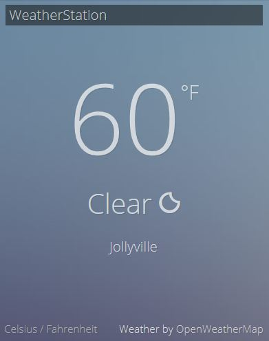

# WeatherStation

A simple weather station app written in JavaScript, developed for the [Front End Development Certification from FreeCodeCamp](https://www.freecodecamp.com/bburns).

Click [here](https://bburns.github.io/WeatherStation) to use.

